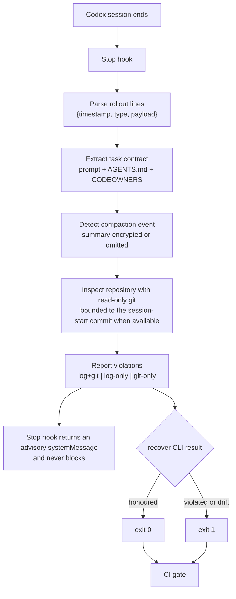

# CodeAnchor — verify a resumed Codex session still honoured the rules you set.

## The problem

Codex compresses long sessions so work can continue within the context window. During repeated compaction, an important constraint can disappear from the context used for later work, leaving the agent unaware that it is breaking a rule. This loss mode is documented in the [openai/codex issue tracker](https://github.com/openai/codex/issues/14347). In current real rollouts, Codex records the compaction event but encrypts or omits the summary, so constraint survival cannot be verified from the session log alone.

## What it does

CodeAnchor checks the repository itself against constraints recovered from the task. Every violation is labelled by evidence source: `log+git`, `log-only`, or `git-only`. The differentiating case is `git-only`: a protected file changed, but the session log contains no tool record that accounts for it.

The verification engine is agent-agnostic: it checks a repository against declared constraints regardless of which coding agent produced the work. Codex is the first supported adapter—the rollout parser and Stop hook—because this is OpenAI Build Week and Codex's encrypted compaction summaries make the problem especially acute. The core reconciliation logic—git evidence, constraint extraction, CODEOWNERS derivation, and path matching—is not Codex-specific.

## Quickstart — see it work in one command

No API key, live Codex session, or backend is required:

```bash
python3 bin/codeanchor demo
```

This initializes the bundled `sample-app` repository and analyzes `fixtures/sample_rollout.jsonl`. The result contains one protected-path change confirmed by both the log and git, plus one change found only by git.

## Install & usage

Install the Python dependencies:

```bash
make install
```

CodeAnchor supports Linux and macOS natively, and Windows through WSL. The Makefile and bundled `sample-app` setup use Bash.

Use CodeAnchor in any of three ways.

**Stop hook.** Install it once to run advisory verification automatically when a Codex session ends:

```bash
python3 scripts/install_codex_hook.py
```

The installer updates `~/.codex/hooks.json` idempotently and preserves other hooks. It also supports `--dry-run` and `--uninstall`. The hook prints a `systemMessage` and always allows the Stop event to complete, including when verification is unavailable.

**On demand.** Analyze the newest local Codex rollout and compare it with the current repository:

```bash
python3 bin/codeanchor recover --latest --repo .
```

Use `--session <rollout.jsonl>` instead of `--latest` to select a specific session, and add `--json` for machine-readable output.

**CI gate.** The `recover` command exits `0` when the contract is honoured, `1` when it finds a violation or drift, and `2` for usage or setup errors. A workflow can analyze a captured rollout artifact directly:

```yaml
name: Verify Codex task contract
on: [push]

jobs:
  codeanchor:
    runs-on: ubuntu-latest
    steps:
      - uses: actions/checkout@v4
      - uses: actions/setup-python@v5
        with:
          python-version: "3.12"
      - run: make install
      - run: python3 bin/codeanchor recover --session artifacts/rollout.jsonl --repo .
```

Constraints come from the opening prompt and the repository's `AGENTS.md`. CodeAnchor also derives protected-path constraints from supported exact-path and whole-directory patterns in the first `CODEOWNERS` file found at `.github/CODEOWNERS`, `CODEOWNERS`, or `docs/CODEOWNERS`.

## Architecture / flow



## How it was built with Codex

The Stop hook, real-schema rollout parser, and production hardening were built in Codex sessions during OpenAI Build Week. The hardening includes session-bounded git evidence, CODEOWNERS-derived constraints, and directory-boundary-aware protected-path matching. This work extends the pre-existing TraceMemory execution-continuity platform, which was itself built with Codex in early July; CodeAnchor adds the Codex adapter and CLI verification surface rather than replacing TraceMemory's core.

The human made the key engineering decisions: use git as an independent evidence source instead of trusting the session log; bound that evidence to the session-start commit; limit GPT-5.6 to one semantic-judgment call site; and, after discovering that Codex encrypts compaction summaries, verify constraint adherence against the repository itself.

The local rollout for this Build Week work is Codex session `019f85db-c295-7be2-a757-7862d69a2b3e`. The corresponding implementation history is preserved in the repository commits, including `8aad2ab`, `2ea5f01`, `13db25e`, `b834de8`, and `9ca3f36`.

## What's tested

The full suite currently reports **85 passed and 3 skipped**. The three skipped tests are optional integrations with TraceMemory's real `ContextHealthService` and run when `TRACEMEMORY_API_PATH` points to its API source tree.

Coverage includes:

- real and legacy rollout schemas, task extraction, tool traces, and compaction detection
- deterministic and GPT-5.6 drift scoring behavior, including failure handling
- real temporary git repositories, session-start bounds, and evidence reconciliation
- path-boundary matching, CODEOWNERS derivation, and multi-compaction aggregation
- Stop-hook subprocess behavior, evidence labels, non-blocking failure handling, and installer idempotency
- end-to-end adapter and CLI recovery behavior

Run it with:

```bash
make test
```

## Known limitations

- Non-path constraints are handled by deterministic content overlap in the keyless path and may be flagged for review rather than judged conclusively. GPT-5.6 scoring is available when `OPENAI_API_KEY` is set.
- Drift-from-summary verification cannot run meaningfully on current real Codex sessions because compaction summaries are encrypted or omitted. CodeAnchor therefore relies on repository and tool-log evidence for those sessions.
- Constraints must be declared in the opening prompt, `AGENTS.md`, or a supported `CODEOWNERS` path pattern. CodeAnchor does not infer arbitrary project policy.
- CodeAnchor verifies constraint adherence, not whether the resulting code is correct or whether every requested requirement was completed.

## Roadmap

- Additional agent adapters—Claude Code and Cursor—reusing the same agent-agnostic verification engine; only the session parser and hook layer are per-agent.
- Package CodeAnchor as a GitHub App and Action for one-click adoption.
- Produce signed, tamper-evident verification reports through TraceMemory's receipt and attestation layer.
- Auto-derive more constraints from branch protection and generated-directory policy.
